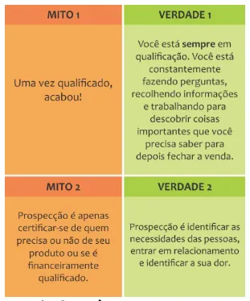

# Leia antes de utilizar os scripts

### 1. **Não escreva em letras maiúsculas:**

- As letras maiúsculas podem ser usadas para destacar uma palavra, por exemplo, mas, em excesso, transmitem agressividade.

### 2. **Não envie mídias sem permissão:**

- Você pode pensar que o uso de áudios, por exemplo, evitaria mal-entendidos. No entanto, só os envie, assim como outras mídias, com permissão dos clientes. Muitos não gostam desse conteúdo e podem achar inconveniente recebê-lo.

### 3. **Padronize sua linguagem:**

- Padronizar otimiza processos e constrói a **identidade da marca**. Portanto, padronize uma comunicação interessada, prestativa e gentil.

### 4. **Foco na preferência do cliente:**

- Perguntar “Como você vai acertar?” mostra mais interesse no **pagamento** do que na **experiência de compra** do cliente. “**Qual é a forma de pagamento de sua preferência?**” é uma forma mais atenciosa.

### 5. Aja com **autenticidade e exclusividade:**

- Evite respostas automáticas e genéricas. Personalize suas mensagens para refletir o estilo da sua empresa e considere as características específicas do cliente para tornar a interação mais autêntica.

### 6. **Ofereça soluções, não apenas produtos:**

- Destaque como seu produto ou serviço resolve problemas específicos do cliente. Foque nas soluções que seu produto oferece, ressaltando os benefícios práticos para o cliente.

### 7. Deixe o cliente falar**:**

- Encoraje perguntas e feedbacks. Uma comunicação precisa ser de ambos os lados, pois ajuda a construir um relacionamento mais forte e permite que o cliente se sinta ouvido e valorizado.

### 8. **Utilize emojis com moderação:**

- Emojis podem adicionar uma dimensão mais amigável à comunicação, mas seu uso excessivo pode parecer não profissional. Utilize-os com moderação e de maneira apropriada ao tom da conversa.

### 9. **Crie senso de pertencimento:**

- Faça com que o cliente se sinta parte da comunidade ou família da sua marca. Use termos que demonstrem que você valoriza a parceria a longo prazo, como: "**BORA VENDER!**”.

### 10. **Seja ágil, mas não invasivo:**

- Responda prontamente, mas respeite o tempo do cliente. Evite enviar mensagens excessivas ou parecer pressionador. A agilidade na resposta deve ser equilibrada com a sensibilidade ao tempo do cliente.

### 11. **Ofereça incentivos exclusivos para aquele cliente:**

- Se possível, personalize ofertas ou descontos com base no histórico de compras ou preferências do cliente. Isso demonstra cuidado e pode aumentar a propensão à compra.

### 12. Faça perguntas ao final de cada mensagem**:**

- Ao direcionar o cliente para a próxima etapa, conduza o cliente com perguntas claras e específicas. Isso ajuda a guiar o cliente no processo de compra, fazendo-o revelar suas **dores** e desejos para que você ofereça a **solução**.

### 13. **Aprenda com o feedback:**

- Esteja aberto ao feedback do cliente e ajuste sua abordagem conforme necessário. Se irritar com uma crítica, só vai te afastar dos resultados que almeja. Ainda que o cliente esteja errado, responda com educação ou simplesmente ignore. O comportamento que você tem diante do feedback contribui diretamente na experiência dos próximos clientes que vierem.

### 14. **Mantenha-se atualizado:**

- Esteja ciente das mudanças nas preferências de comunicação e tecnologias. Adapte suas estratégias conforme as tendências do mercado e as preferências dos clientes evoluem.

A aplicação dessas dicas contribuirá para uma comunicação mais eficaz no WhatsApp/Direct, construindo relações positivas com os clientes e aumentando as chances de sucesso nas vendas.


# Qual a importância de ter um script de vendas?

### 1. Respostas Imediatas:

Hoje nossa comunicação via WhatsApp e Direct é muito maior do que qualquer outra, porque ocorre de forma instantânea. Possuir um script de vendas adequado, assegura que você esteja sempre pronto para responder às perguntas dos clientes de maneira **rápida** e **eficaz**.

### 2. **Consistência na Comunicação**:

Independentemente de qual membro da equipe esteja interagindo com o cliente, um script garante a manutenção de uma mensagem de marca consistente. Isso contribui para a construção de confiança e autoridade.

### 3. Aumento da Confiança:

Ao contar com um exemplo de script de vendas específico para o WhatsApp, a probabilidade de cometer equívocos ou expressar algo inesperado é significativamente reduzida. Essa preparação prévia transmite confiança ao cliente, evidenciando um profissionalismo sólido.

### 3. Eliminação de Incertezas:

Em vez de tentar adivinhar as preferências do cliente, um script de vendas no WhatsApp oferece um guia claro sobre quais pontos abordar, assegurando que você enfrente as principais preocupações e objeções do cliente.

### 4. Avaliação e Aprimoramento:

Munido de um script, torna-se mais simples rastrear o que está funcionando e o que não está. Essa capacidade facilita ajustes e otimizações contínuas, resultando em uma melhoria constante na eficácia da sua abordagem de vendas.


# Aplique os scripts e aumente suas vendas

```flow
*Clique nos itens abaixo para acessar*
```

### Pré-venda

[Mensagens automáticas](https://www.notion.so/Mensagens-autom-ticas-6c6405d5f42d413da7f98330e033cf45?pvs=21)

[Prospecção](https://www.notion.so/Prospec-o-1fa030ca09c940098cd18d4af0484cfe?pvs=21)

### Venda

[Apresentação](https://www.notion.so/Apresenta-o-7287fc7bd336485cb654e871c07cc0a7?pvs=21)

[Qualificação](https://www.notion.so/Qualifica-o-8eeb3e428cda425ca9448caca1eeaddf?pvs=21)

[Negociação](https://www.notion.so/Negocia-o-ac533a014ef44257a705dd1ebb13b07c?pvs=21)

[Quebra de objeções](https://www.notion.so/Quebra-de-obje-es-31b2362785514091a1c13781143dd290?pvs=21)

[Fechamento](https://www.notion.so/Fechamento-6c725da2a65f44b8ac99d9ed6f93fa00?pvs=21)

[Follow-up](https://www.notion.so/Follow-up-bda7329ef2754fbbb5e055091ef53635?pvs=21)

### Pós-venda

[Suporte](https://www.notion.so/Suporte-1840759fd78d4813919bc5958ec30769?pvs=21)

[Customer Sucess](https://www.notion.so/Customer-Sucess-bb3d7fe17c224450a7f99d66a679bcd5?pvs=21)

```flow
Entenda cada fase da venda abaixo:
```

A negociação pode ser dividida em diversas fases, desde o estágio inicial de prospecção até o acompanhamento pós-venda. Vamos explorar cada uma dessas fases:

### Fase 1: Pré-venda

**Prospecção:**

- Nesta fase, o foco está em identificar potenciais clientes ou oportunidades de negócios. Isso envolve pesquisa, coleta de dados e abordagens para atrair a atenção de leads qualificados.

### Fase 3: Pós-venda

**Follow-up:**

- Após a venda, o acompanhamento é essencial para garantir a satisfação do cliente, resolver problemas emergentes e manter a relação. Pode envolver agradecimentos, pedidos de feedback e informações sobre novos produtos ou serviços.

**Suporte:**

- Após a compra, os clientes podem precisar de assistência técnica, suporte ou esclarecimento de dúvidas. Uma equipe de suporte eficaz é vital para manter a satisfação do cliente.

**Customer Success**

- Vai além do suporte, visando garantir que o cliente obtenha o máximo valor do produto ou serviço. Envolve ações proativas para garantir a adoção adequada e o contínuo sucesso do cliente.

### Fase 2: Venda

**Apresentação:**

- Uma vez identificados os leads, a fase de apresentação concentra-se em introduzir o produto ou serviço de maneira envolvente e persuasiva. O objetivo é despertar o interesse do cliente e destacar os benefícios.

**Qualificação:**

- Aqui, avaliam-se mais a fundo as necessidades e características do cliente. A qualificação é crucial para garantir que o tempo seja dedicado a oportunidades que têm maior probabilidade de fechamento.

**Negociação:**

- Durante a fase de negociação, são discutidos detalhes como preço, condições de pagamento, prazos e outros termos contratuais. Ambas as partes buscam um entendimento mútuo e benefícios para ambas as partes.

**Quebra de Objeções:**

- Os clientes podem levantar objeções durante a negociação. Nesta fase, o vendedor deve abordar essas preocupações de maneira eficaz, fornecendo informações adicionais, esclarecendo dúvidas e superando barreiras.

**Fechamento:**

- É o momento crucial em que se busca obter o comprometimento do cliente para a compra. Estratégias de fechamento são aplicadas para selar o acordo.

Cada fase é crucial para o processo de vendas e requer habilidades específicas para conduzir as interações de maneira eficaz. O entendimento dessas fases ajuda os profissionais de vendas a desenvolver estratégias adequadas para cada etapa do ciclo de negociação.


# O script personalizado para o seu negócio

Criar um script personalizado para o seu negócio é essencial para você ou seu time comercial otimizar o processo da venda do seu produto ou serviço.

Ao desenvolver um script personalizado, é possível destacar os pontos-chave, superar objeções de maneira eficiente e direcionar a conversa de forma estratégica, facilitando assim a condução até o fechamento da negociação. 

Além disso, um script bem elaborado proporciona confiança ao profissional, assegurando que ele esteja preparado para lidar com diversas situações, maximizando as chances de sucesso em cada interação com o cliente.

Aqui estão tipos de exemplo de script de vendas para WhatsApp ou Direct que você pode considerar:

```flow
*Clique nos itens abaixo para acessar*
```

[**Abordagem inicial e quebra de objeções**](https://www.notion.so/Abordagem-inicial-e-quebra-de-obje-es-dcc3d1067be843328d06a17f718ec781?pvs=21)

[**Apresentação de produto ou serviço e seus benefícios**](https://www.notion.so/Apresenta-o-de-produto-ou-servi-o-e-seus-benef-cios-2d0f8772f310434283bd27738c269f67?pvs=21)

[**Incentivo com ofertas ou descontos especiais**](https://www.notion.so/Incentivo-com-ofertas-ou-descontos-especiais-a759fc4cfd3d4fa2b31cfebddbc40308?pvs=21)

[Engaje o cliente com o uso de storytelling](https://www.notion.so/Engaje-o-cliente-com-o-uso-de-storytelling-c36727a269354d56baaff568eb78a985?pvs=21)

[**Conclusão e fechamento da venda**](https://www.notion.so/Conclus-o-e-fechamento-da-venda-5de56ec8a8134bcfb85093734cc13ff1?pvs=21)


# 25 frases persuasivas para fechar qualquer venda

Aqui estão 25 frases que você pode utilizar na negociação com o cliente. São possíveis argumentos persuasivos para efetivar a venda.

Frase 1
Você procura preço ou qualidade? Porque se for somente pelo preço, meu concorrente com certeza te atende. Mas se for [BENEFÍCIOS DO SEU PRODUTO/SERVIÇO].

Frase 2
Ao tomar essa decisão, você estará investindo não apenas em um [PRODUTO/SERVIÇO], mas em uma transformação completa.

Frase 3
Mal posso esperar para ouvir suas histórias de sucesso depois de adquirir esse [PRODUTO/SERVIÇO].

Frase 4
Faça parte do grupo exclusivo que já está desfrutando dos benefícios exclusivos deste [PRODUTO/SERVIÇO].

Frase 5
Ao escolher este [PRODUTO/SERVIÇO], você está escolhendo mais do que um item, está escolhendo um estilo de vida.

Frase 6
Não é uma questão de sorte; é uma questão de tomar a decisão certa na hora certa.

Frase 7
Estou ansioso(a) para testemunhar o [IMPACTO POSITIVO] que esse [PRODUTO/SERVIÇO] fará na [ÁREA DE TRANSFORMAÇÃO DO SEU PRODUTO/SERVIÇO].

Frase 8
Sem sombra de dúvida, esse [PRODUTO/SERVIÇO] é o que vai mudar [SITUAÇÃO ATUAL DO CLIENTE].

Frase 9
Não compre esse [PRODUTO/SERVIÇO], a menos que queira parecer [BENEFÍCIO]. Ex.: "Não faça botox, a menos que queira parecer 10 anos mais jovem"; "Não compre essa casa, a não ser que queira ser chamada de milionária".

Frase 10
De que forma você prefere realizar o pagamento, X ou Y? (Dessa forma o cliente só visualiza essas duas opções de escolha).

Frase 11
Qual horário fica melhor para você, 14h ou 16h? (Nunca pergunte se a pessoa quer agendar, já disponibilize as opções de escolha).

Frase 12
Você procura preço ou qualidade? Porque se for somente pelo preço, meu concorrente com certeza te atende. Mas se for [BENEFÍCIOS DO SEU PRODUTO/SERVIÇO].

Frase 13
Quando você perceber o potencial desse [PRODUTO/SERVIÇO], se perguntará por que não o descobriu antes.

Frase 14
Em um mercado saturado de opções, [PRODUTO/SERVIÇO] se destaca como a melhor escolha para [DOR QUE O CLIENTE TE APRESENTOU].

Frase 15
Se eu estivesse no seu lugar, na sua situação e com essa proposta irrecusável do [PRODUTO/SERVIÇO], eu não pensaria duas vezes em tomar a decisão.

Frase 16
Não tenho dúvida [FULANO] que este é o melhor negócio do ano que você irá fazer.

Frase 17
Gostaria de saber, você prefere o [PRODUTO/SERVIÇO] X ou o [PRODUTO/SERVIÇO] Z?

Frase 18
Você sabe que esta proposta é o melhor custo-benefício do mercado [FULANO].

Frase 19
Mais cedo ou mais tarde, você verá que fez a escolha certa em fecharmos o acordo sobre o [PRODUTO/SERVIÇO].

Frase 20
Se não fecharmos hoje, amanhã você me perguntará: por que não tomei a decisão de adquirir o [PRODUTO/SERVIÇO] antes.

Frase 21
Não vou te pressionar a decidir agora, mas sabe que essa é a melhor escolha para ambos.

Frase 22
Mais cedo ou mais tarde, você se perguntará: porque não encontrei este [PRODUTO/SERVIÇO] antes.

Frase 23
Não preciso pedir que confie em mim, você sabe que a [SOLUÇÃO] que estou te apresentando com o [PRODUTO/SERVIÇO] vai resolver 100% sua [DOR/PROBLEMA].

Frase 24
O que você precisa para fecharmos nosso acordo [FULANO]? 

Frase 25
Poderia dizer que os [PRODUTOS/SERVIÇOS] são perfeitos para você, mas quero que você descubra isso sozinho.


# 11 frases para nunca utilizar em uma negociação

Ao evitar frases prejudiciais e adotar estratégias mais positivas, você estará mais bem preparado para alcançar um novo nível nas vendas. Elevando sua abordagem de negociação, você construirá relacionamentos mais fortes e duradouros, fundamentais para o sucesso no relacionamento com seus clientes.

Aqui estão 11 frases que você DEVE evitar em suas negociações e insights sobre como substituí-las por abordagens mais eficazes.

Frase 1
Para ser honesto com você/Vou ser honesto com você

❌ Esta expressão pode sugerir que, em outros momentos, você não está sendo honesto. A honestidade deve ser uma prática constante, e usar essa frase pode levantar dúvidas sobre a integridade nas outras partes da conversa.

Frase 2
Para ser franco com você/Vou ser transparente com você

❌ Similar à primeira frase, o uso dessas expressões pode fazer com que a outra parte questione a transparência em outras ocasiões. A transparência e franqueza devem ser a norma em uma negociação.

Frase 3
Confie em mim/Acredite em mim

❌ Pedir confiança diretamente pode levantar suspeitas. A confiança deve ser conquistada por meio de ações e demonstrações consistentes ao longo do tempo, e não por uma simples declaração.

Frase 4
Desculpa incomodar/Desculpe atrapalhar

❌ Essa frase pode diminuir a sua posição na negociação e sugerir que sua presença ou comunicação é inconveniente. É melhor abordar a conversa de maneira positiva e assertiva.

Frase 5
Estou apenas acompanhando você/Estou entrando em contato pra te acompanhar

❌ Isso pode parecer invasivo ou excessivamente insistente. Em vez disso, concentre-se nos benefícios da continuação da conversa e no valor que você pode oferecer.

Frase 6
Você quer comprar qual desses?

❌ Nunca use a palavra “COMPRAR”, nunca fale essa palavra “COMPRAR”, não reforce este comportamento, use a palavra “TER”, “POSSUIR” (ex: você gostaria de possuir o [PRODUTO/SERVIÇO]?) ao invés de (ex: você gostaria de COMPRAR o [PRODUTO/SERVIÇO].

Frase 7
Agora só falta assinar o contrato!

❌ Nunca use a palavra “contrato”, a pessoa já pensa: “Ah, terei que ler várias páginas?” A sensação é de prisão. Use: “termos do nosso acordo”.

Frase 8
Não tive notícias suas/Não recebi um retorno seu [FULANO].

❌ Essa frase pode transparecer culpa e colocar a outra pessoa na defensiva. É melhor abordar a falta de resposta de maneira mais neutra, como solicitando um retorno ou esclarecendo a necessidade de comunicação.

Frase 9
Eu sei que você é uma pessoa muito ocupada / Eu sei que você não tem muito tempo.

❌ Essa declaração pode parecer presumida e não levar em conta a priorização individual. É melhor focar na relevância e benefícios da conversa.

Frase 10
Somos melhores que a empresa X, Y e Z/ Somos os melhores do mercado

❌ Essa afirmação pode parecer arrogante e afastar a outra parte. É mais eficaz destacar os pontos fortes e vantagens específicas sem menosprezar a concorrência.

Frase 11
Está barato, quando você diz que seu produto “esta barato” você tira totalmente a percepção de valor dele mediante ao seu cliente.

❌ Indicar que algo está barato pode desvalorizar o produto ou serviço, sugerindo que não é de alta qualidade. É melhor comunicar o valor intrínseco e os benefícios do que simplesmente focar no preço baixo.


# Perfis de clientes

### Cliente Pragmático

Para conquistar o cliente pragmático, que **valoriza um tratamento formal** e eficiente, é essencial adotar técnicas de vendas diretas e sem rodeios. Este comprador prefere soluções rápidas e objetivas para seus problemas. Agindo como o profissional que domina completamente o produto, a abordagem mais eficaz é fornecer respostas claras e demonstrar segurança.

### Cliente Analítico

O cliente analítico **busca informações detalhadas** e gosta de analisar todos os aspectos antes de tomar uma decisão de compra. Para lidar com esse comprador, é crucial utilizar técnicas que abordem suas objeções, já que ele procura ter uma compreensão completa antes de avançar. A dica aqui é adotar uma abordagem formal, oferecendo dados substanciais e permitindo que ele tire conclusões por si mesmo.

### Cliente Afável

Diferente dos perfis anteriores, o cliente afável é mais **emocional** e valoriza relações interpessoais. Este comprador aprecia conversas sobre família, trabalho e rotina. A chave para conquistá-lo está na confiabilidade. Mostrar que você se preocupa com seu bem-estar e que é digno de confiança é essencial para ganhar sua lealdade.

### Cliente Expressivo

O cliente expressivo, semelhante ao pragmático na busca por rapidez, **destaca-se pela extroversão** e desejo de ser o centro das atenções. Gosta de informalidade e busca um relacionamento mais intenso, porém, mantendo um nível profissional. As técnicas de vendas eficazes para esse perfil baseiam-se em construir um relacionamento sólido, com elogios e demonstrações de parceria.


# Gatilhos mentais

| Reciprocidade | Ofereça algo de valor ao seu contato, como um brinde, cupom de desconto ou uma dica útil. A tendência natural é retribuir quando se recebe algo valioso. |
| --- | --- |
| Prova Social | Envie depoimentos de outros clientes sobre seus produtos e serviços. A prova social remove dúvidas e fortalece a confiança do cliente. |
| Escassez | Destaque a escassez do produto ou serviço, informando que restam poucas unidades ou que as inscrições estão prestes a encerrar. Isso motiva o cliente a agir para não perder a oportunidade. |
| Autoridade | Transmita a sensação de autoridade no assunto que está abordando. Seja reconhecido como um especialista na área. Se está falando sobre hot-dogs, faça-o sentir que você produz um dos melhores. Se é a venda de carros, demonstre ser um expert no assunto. |
| Antecipação | Utilize o gatilho da novidade, especialmente eficaz para compradores por impulso. Se seu contato é propenso a aderir a novidades, destaque-as em suas ofertas.
Integrar esses gatilhos nas suas estratégias de venda pode aumentar significativamente a eficácia das suas ofertas. |


# SCRIPTS

## Mensagens automáticas
### Saudação no WhatsApp

A seguir alguns exemplos de mensagens para saudação no WhatsApp:

| Exemplo 1 | Olá! Seja bem-vindo a [EMPRESA]! |
| --- | --- |
|  | Me chamo [NOME]. Como posso te ajudar hoje? [EMOJI] |
| Exemplo 2 | Olá! Bem vindo a [EMPRESA]! Ficamos felizes em atendê-lo. Para iniciarmos nosso bate papo, poderia nos dizer seu nome, por gentileza? |
| Exemplo 3 | Olá, seja muito bem-vindo a [EMPRESA].
Como podemos lhe auxiliar hoje [NOME]? [EMOJI] |

Uma dica valiosa é sempre perguntar e tratar o cliente pelo nome.


### Ausência no WhatsApp

A seguir alguns exemplos de mensagens para ausência no WhatsApp:
Exemplo 1
Olá! Seja bem-vindo a [EMPRESA]!
Não estamos disponíveis no momento, [NOME]. Nosso horário de atendimento é das [HORÁRIO] às [HORÁRIO]. Deixe sua dúvida abaixo, que assim que retornarmos, responderemos o mais breve possível [EMOJI].
Exemplo 2
Olá! Agradecemos seu contato. No momento, nosso time não esta disponível, estamos [MOTIVO DA AUSÊNCIA].
Exemplo 3
Escreva sua mensagem e em breve iremos te retornar. Até logo! [EMOJI]


## Prospecção

### Ao prospectar um lead frio

A seguir alguns exemplos de mensagens para prospecção fria através do WhatsApp/Direct:

| Exemplo 1 | Olá [FULANO], tudo bem? É da empresa X? |
| --- | --- |
|  | Vimos que você ainda não se posiciona na internet, não produz conteúdos, gostaria de marcar um breve bate papo com você, 05 minutinhos, para lhe apresentar como escalar suas vendas em menos de 90 dias, como você esta de horário no dia X, horário Y? |
| Exemplo 2 | Olá [FULANO], como vai? |
|  | Estou entrando em contato pois vimos que seus concorrentes anunciam e você não, por isso ele esta a frente de você nas vendas. |
|  | Queria saber como esta sua agenda no dia X, na hora Y, para um breve bate papo com nosso especialista no seu [SEGMENTO]. |
|  | Vamos escalar suas vendas dentro de [PERÍODO DE DIAS]. |
|  | Faz sentido pra ti [FULANO]? |

Uma dica valiosa é sempre abrir o perfil do cliente no WhatsApp e verificar o nome, se você não souber o nome do cliente, peça antes de realizar qualquer outra pergunta. Ok?

### Ao receber uma indicação

A seguir exemplos de indicações:

| Exemplo 1 | E aí [FULANO], tudo bem? |
| --- | --- |
|  | O [NOME] indicou seu contato para batermos um breve papo a respeito do [ASSUNTO]-[INTERESSE]. |
|  | Como esta sua disponibilidade no dia X, no horário Y? |
| Exemplo 2 | E aí [FULANO], como você está? O [NOME] indicou seu contato para fazer um orçamento para seu negócio. |
|  | Como foi indicação do [NOME], tenho uma condição mais que especial pra ti. |
|  | Como esta sua agenda no dia X, no horário Y para conversarmos 5 minutinhos [FULANO]? |

Lembre-se de sempre abrir o perfil do cliente no WhatsApp e verificar o nome, se você não souber o nome do cliente, peça antes de realizar qualquer outra pergunta. Ok?


# VENDA

## Apresentação

### Se apresente e peça permissão para fazer perguntas

| Exemplo 1 | Olá [FULANO], como está? Eu sou o [NOME] da [EMPRESA] e vou te ajudar. Para que eu possa ser o mais assertivo possível, vou te fazer algumas perguntas, tudo bem? |
| --- | --- |
| Exemplo 2 | Bom dia [FULANO], tudo bem? Eu sou o [NOME] da [EMPRESA] e vou fazer o seu atendimento. Para que eu possa entender melhor sua necessidade, vou realizar algumas perguntas, ok? |

Uma dica valiosa é sempre abrir o perfil do cliente no WhatsApp e verificar o [NOME],

se você não souber o nome do cliente, peça antes de realizar qualquer outra pergunta. Ok?

### Mensagens personalizadas para o contato inicial

Mensagens para o contato inicial com o cliente

| Exemplo 1 | Olá [FULANO], tudo bem? Me chamo [NOME], sou responsável pelo setor comercial da [EMPRESA X], será um prazer lhe atender. |
| --- | --- |

Adicionar os seguintes exemplos de acordo com o seu negócio:

Exemplo 1
Como podemos lhe ajudar?
Exemplo 2
O que exatamente você busca hoje [FULANO]?
Exemplo 3
Qual produto mais te agradou? X ou Y?

## Qualificação

### O lead deu permissão para as perguntas, agora entenda a necessidade dele

| Exemplo 1 | Como posso ajudar você hoje? Existe algo específico que esteja procurando? |
| --- | --- |
| Exemplo 2 | Ao entrar em contato, há algo em particular que chamou sua atenção sobre nosso [PRODUTO/SERVIÇO]? |
| Exemplo 3 | Para melhor atendê-lo, posso saber quais são suas principais metas ou desafios no momento? |
| Exemplo 4 | Sei que cada cliente é único. Você poderia compartilhar um pouco sobre suas necessidades ou expectativas em relação ao que oferecemos? |
| Exemplo 5 | Antes de começarmos, existe uma área específica em que você gostaria de obter mais informações ou suporte? |

Essas perguntas iniciais ajudam a estabelecer um entendimento inicial das necessidades do lead e a direcionar a conversa para áreas específicas que possam ser mais relevantes para ele.

Você neste momento esta realizando uma PRÉ-QUALIFICAÇÃO!

### Descubra se a pessoa é o seu cliente potencial

Em caso de prestação de serviço, você precisa saber se este cliente tem o perfil ideal para seu negócio, se ele faz parte do seu ICP.

Neste momento você pode qualifica-lo através de um formulário ou através de perguntas discretas que você identificará se ele tem potencial de compra ou não.

Veja alguns exemplos a seguir:

Exemplo 1
Exemplo 1 - Olá [FULANO], tudo bem? Me chamo [NOME], sou responsável pelo [SETOR] da [EMPRESA].
Estou enviando um formulário: [LINK], para ser preenchido. Ok?

Exemplo 2
Exemplo 2 - Olá [FULANO], tudo bem? Me chamo [NOME], sou responsável pelo [SETOR] da [EMPRESA].
Quantas vendas do [PRODUTO/SERVIÇO] você realiza no mês?

Exemplo 3
Exemplo 3 - Olá [FULANO], tudo bem? Me chamo [NOME], sou responsável pelo [SETOR] da [EMPRESA].
Qual seu ticket médio na venda do [PRODUTO/SERVIÇO?]

Exemplo 4
Olá [FULANO], tudo bem? Me chamo [NOME], sou responsável pelo [SETOR] da [EMPRESA].
Quantos funcionários você tem hoje disponível hoje para atender a demanda comercial que chegará na sua [EMPRESA]?

Exemplo 5
Olá [FULANO], tudo bem? Me chamo [NOME], sou responsável pelo [SETOR] da [EMPRESA].
Quanto você teria disponível para realizar o investimento neste [PRODUTO/SERVIÇO] hoje?
Abaixo de X? Acima de Y? Acima de Z?


### Faça um comentário leve e descontraído

Nesse ponto, você vai adaptar a sua realidade. Vou deixar alguns exemplos aqui de
mercados variados e aleatórios. Mas você deve ajustar essas mensagens de acordo com o seu avatar (personificação do cliente ideal) e seu nicho de mercado. 

Além disso, é importante definir o perfil do seu cliente, se cabe um comentário para se conectar com ele, explico isso na parte do conteúdo:

[Perfis de clientes](https://www.notion.so/Perfis-de-clientes-1ea5c6e303a5475eaae6aa7133993662?pvs=21)

| Exemplo 1 | Meu sonho é ter um carro desse mesmo modelo do seu! |
| --- | --- |
| Exemplo 2 | Que carrão hein Sr. Jorge, isso é uma máquina! |
| Exemplo 3 | Nossa, como a sua conta de energia está cara! Que bom que você veio aqui pra gente te ajudar a resolver isso. |
| Exemplo 4 | Você acredita que acabei de fechar um negócio aqui com um cliente que estava na mesma situação que você? |
| Exemplo 5 | Eu também já passei por essa mesma situação que você e te entendo, não é
fácil. |

Não se esqueça de realizar uma análise do perfil comportamental do seu cliente antes de realizar qualquer tipo de abordagem/negociação descontraída. Ok?


### Cliente que te procura e depois desaparece

O jogo sempre será de perguntas, nunca passe o valor ou preço logo de cara.
Pergunte aos poucos o que você precisa saber para extrair informações crucias para negociação.
Exemplo 1
Para lhe atender melhor, preciso saber mais sobre o que você busca hoje [FULANO].
Como falei no início deste conteúdo: sempre faça perguntas, vence a negociação quem sempre devolve a pressão pro outro lado.
Outros exemplos para guiar essas situações:
Exemplo 1
[FULANO] já vou te passar os valores mas antes precisaria entender melhor o seu caso.
Exemplo 2
[FULANO], você já adquiriu/consumiu o [PRODUTO/SERVIÇO] antes ou seria sua primeira experiência?
Exemplo 3
[FULANO], você esta buscando quais benefícios exatamente?


### Cliente que pergunta o preço logo de início

Quando um cliente pergunta pelo preço logo no início de uma conversa por WhatsApp ou Direct, é importante abordar a questão de uma maneira que permita continuar a construção de relacionamento e destaque o valor do seu produto ou serviço.

| ❌ Qual o preço, por favor? |
| --- |
| ❌ Quero saber o valor! |

| Exemplo 1 | [FULANO], depende. Depende exatamente do que você esta procurando, porque não me conta um pouco o que você precisa/busca no [PRODUTO/SERVIÇO]? |
| --- | --- |
| Exemplo 2 | [FULANO], já vou te passar as condições, mas antes queria entender melhor a sua [DOR/PROBLEMA], para apresentar a melhor proposta do [PRODUTO/SERVIÇO]. |
| Exemplo 3 | [FULANO], pra ser o mais assertivo em lhe oferecer o [PRODUTO/SERVIÇO], me fala um pouco mais da sua [DOR/DESEJO]? |

| ✅ Demonstre interesse |
| --- |

| Exemplo 1 | [FULANO], antes de falarmos sobre o preço, eu gostaria de entender um pouco mais sobre as suas necessidades e expectativas. Assim, poderei oferecer a melhor solução para você. O que exatamente você está procurando? |
| --- | --- |

| ✅ Destaque os benefícios |
| --- |

| Exemplo 1 | Compreendo que o preço é uma parte importante da decisão [FULANO], mas antes de falarmos sobre isso, gostaria de destacar alguns dos benefícios que nosso produto/serviço oferece. Estou certo de que você ficará impressionado com o valor que proporcionamos, tudo bem? |
| --- | --- |

| ✅ Personalize a abordagem |
| --- |

| Exemplo 1 | [FULANO], cada cliente é único, e queremos garantir que oferecemos a melhor opção para atender às suas necessidades específicas. Poderia me contar mais sobre o que você procura para que eu possa fornecer uma proposta mais precisa? |
| --- | --- |

| ✅ Forneça uma faixa de preço |
| --- |

| Exemplo 1 | Compreendo que o preço é uma consideração importante, [FULANO]. Para que eu possa lhe fornecer uma estimativa mais precisa, poderia me dar uma ideia do seu orçamento ou faixa de preço que está considerando? |
| --- | --- |

| ✅ Destaque os diferenciais |
| --- |

| Exemplo 1 | [FULANO], antes de discutirmos os valores, gostaria de compartilhar alguns dos diferenciais do nosso produto/serviço que o tornam único no mercado. Isso pode influenciar a percepção do valor que oferecemos, tudo bem? |
| --- | --- |

| ✅ Agende uma conversa ou um meeting |
| --- |

| Exemplo 1 | [FULANO], entendo que o preço é uma informação crucial. Podemos agendar uma breve chamada para eu entender melhor suas necessidades e oferecer uma proposta personalizada que atenda às suas expectativas? |
| --- | --- |

O objetivo é direcionar a conversa para um entendimento mais profundo das necessidades do cliente antes de abordar diretamente o preço. Isso permite que você destaque o valor agregado do seu produto ou serviço e crie uma base mais sólida para a negociação.

## Negociação

### Como avançar para uma proposta

Avançar para uma proposta efetiva requer uma abordagem estruturada e estratégica. 

Ao final da apresentação do produto/serviço, faça uma pergunta que induza o cliente a expressar seu compromisso ou a fornecer feedback específico.

Abaixo estão algumas etapas que você pode seguir para avançar em seu funil. Lembre-se de evitar perguntas fechadas e opte por algo como:

| Exemplo 1 | [FULANO], agora que entendi o que você busca ao adquirir o [PRODUTO/SERVIÇO], o que você acha dessa proposta? |
| --- | --- |
| Exemplo 2 | [FULANO], meu [PRODUTO/SERVIÇO] é o ideal para a solução você busca hoje. Como você vê isso se encaixando em suas necessidades? |
| Exemplo 3 | [FULANO], depois de analisar nosso bate papo, qual solução de tudo o que conversamos faz mais sentido pra você? |

Programe um acompanhamento para discutir a proposta, esclarecer dúvidas e abordar quaisquer preocupações que possam surgir durante essa etapa.


## Quebra de Objeções

### Objeções de preço

Ao lidar com clientes que recusam o seu produto ou serviço devido à falta de dinheiro, é crucial abordar a situação de maneira estratégica. A alegação de "não tenho dinheiro" é frequentemente usada como uma **desculpa padrão** para expressar desinteresse ou a ausência de valor percebido. Para discernir a veracidade dessa objeção, é fundamental formular a pergunta correta, como segue:

| Exemplo 1 | Esse produto custa X reais. Esse preço cabe no seu bolso hoje? |
| --- | --- |

Ao receber um "sim”, a objeção financeira geralmente não ressurgirá durante a apresentação da proposta. No entanto, se o cliente falar "não", significa que o preço ultrapassa suas possibilidades financeiras, assim a negociação pode seguir dessa forma:

| Exemplo 2 | Nesse caso, qual seria o preço viável para fecharmos negócio? |
| --- | --- |

| Cliente: Em torno de Y reais. |
| --- |

| Exemplo 3 | Então, se por acaso eu conseguir esse mesmo produto por Y reais, a gente fecha negócio agora? |
| --- | --- |

| Cliente: Sim |
| --- |

Ao abordar a questão dessa maneira, não apenas você supera a objeção inicial, mas também estabelece uma base para negociações futuras, demonstrando flexibilidade e disposição para encontrar um ponto de acordo financeiramente viável para ambas as partes.

O cliente também pode expressar preocupações financeiras ao receber uma oferta. Identificar essa objeção pode ser desafiador, mas você pode utilizar argumentos verdadeiros para destacar o valor da solução, mostrando os **benefícios** em relação ao custo.

| ❌ Está muito caro para o meu orçamento atual. |
| --- |
| ❌ Não posso investir tanto neste momento. |

| Exemplo 1 | Entendo [FULANO], o valor é condizente ao [RESULTADO/DURABILIDADE/BENEFÍCIO] e te garanto que você não precisará adquirir este [PRODUTO/SERVIÇO] barato por diversas vezes. |
| --- | --- |
| Exemplo 2 | Entendo [FULANO], mas você está comparando o valor com qual outro [PRODUTO/SERVIÇO] do mercado? |
| Exemplo 3 | [FULANO], você busca preço ou qualidade? Preciso entender para ver se este [PRODUTO/SERVIÇO] é para você. |

### Objeções de urgência
Alguns clientes adiam a decisão de compra, acreditando que a solução estará disponível no futuro. O desafio é convencê-los da importância de decidir no momento, utilizando gatilhos mentais, como a escassez, para criar um senso de urgência.

❌ Vou pensar e te retorno.

❌ Gostei da sua oferta, mas não vou fechar agora. Quem sabe no mês que vem?

Quando uma pessoa está com fome, ela quer comer agora, e não daqui a duas horas. Da mesma forma, uma pessoa que precisa resolver um problema, ela quer resolver, e não no mês que vem.
Portanto, se um cliente diz algo assim, é porque ele ainda não despertou o senso de urgência que, na maioria dos casos, cabe a você fazer.

Exemplo 1
Realmente [FULANO], compreendo e concordo que precisamos pensar pra tomar uma decisão muito importante.
Diante disso, o que você precisaria pensar pra se sentir mais seguro pra tomar a decisão de adquirir o [PRODUTO/SERVIÇO]?

Exemplo 2
[FULANO], se você precisa pensar é porque nosso bate papo te gerou alguma dúvida, o que exatamente está te fazendo pensar?

Exemplo 3
[FULANO], o que exatamente é necessário para fecharmos negócio? O que te faz pensar? É preço? Digamos que temos condições especiais para ter agora o [PRODUTO/SERVIÇO], teríamos um acordo [FULANO]?

Exemplo 4
Você me disse estar procurando [PRODUTO/SERVIÇO] para resolver [DOR QUE LEAD APRESENTOU]. Isso é uma prioridade agora?

❌ Preciso conversar com meu marido e entro em contato.

❌ Vou analisar com meu sócio e te chamo.

Quando o seu cliente te afirma que não é o tomador de decisão, você precisa identificar se é verdade ou se trata de uma desculpa. Seguem alguns exemplos de como retomar o controle da negociação.

Exemplo 1
[FULANO] se dependesse apenas de você agora, fecharíamos negócio?

Exemplo 2
[FULANO] o que é que você precisa mostrar/apresentar pra essa pessoa aprovar a tomada de decisão?

Exemplo 3
[FULANO] você gostaria que conversássemos juntos com [O(A) TOMADOR(A) DE DECISÃO], para explicar a solução do [SERVIÇO/PRODUTO] de maneira mais assertiva para avançarmos na negociação?

❌ Entrarei em contato com você na segunda, pode ser?

Essa objeção pode se tratar de uma tentativa de postergar decisões, mas também pode ser que o cliente não viu valor na sua proposta. Precisamos saber para retomarmos a negociação.

Exemplo 1
[FULANO], você sabe que geralmente quando conversamos com alguém nunca mais essa pessoa retorna, então vou ser direto, o que é necessário para concretizarmos o negócio do [PRODUTO/SERVIÇO] hoje?

Exemplo 2
[FULANO], preciso da verdade para avançarmos na negociação, você precisa pensar? Algo te deixou em dúvida?

Exemplo 3
[FULANO], qual parte do [PRODUTO/SERVIÇO] você não te agradou? Poderia me dizer para sermos o mais assertivo possível em nossa negociação?

### Objeções de necessidade

Alguns clientes podem pensar que não precisam da solução que você oferece. As técnicas abaixo vão te ajudar a extrair informações e demonstrar como a sua solução pode ser útil, invertendo a prioridade percebida pelo cliente.

| ❌ Não estou interessado, já tenho alguém que preste este SERVIÇO. |
| --- |

| Exemplo 1 | [FULANO], eu entendo, deixa te fazer uma pergunta, na próxima vez que você estiver procurando o [PRODUTO/SERVIÇO], posso ser a primeira pessoa quando você pensar no [PRODUTO/SERVIÇO]? |
| --- | --- |

| ❌ Não estou interessado, já tenho este PRODUTO. |
| --- |

| Exemplo 1 | [FULANO], o que precisa acontecer pra você procurar o meu [PRODUTO/SERVIÇO]? |
| --- | --- |

Quando descobrir essas dores, faça um follow-up de tempo em tempo com este cliente que lhe deu a permissão e tente ganhá-lo cada vez que você entrar em contato.

| ❌ Não vejo como isso resolveria meu problema. |
| --- |

| Exemplo 1 | [FULANO], compreendo suas preocupações. Pode me contar mais sobre os desafios específicos que você enfrenta? Isso me ajudará a entender melhor como podemos adaptar nosso produto/serviço para atender às suas necessidades. |
| --- | --- |
| Exemplo 2 | [FULANO], fique à vontade para compartilhar mais detalhes sobre o problema que está enfrentando. Estou aqui para encontrar uma solução personalizada para você. Quais são os aspectos específicos que você acredita que não atendemos atualmente? |
| Exemplo 3 | [FULANO], gostaria de ouvir mais sobre sua experiência até agora. Quais são as expectativas que você tem em relação a uma solução para o seu problema? Estou aqui para ajustar nossa oferta de acordo com suas necessidades. |

| ❌ Acredito que não preciso desse produto ou serviço. |
| --- |

| Exemplo 1 | Entendo que pode não parecer necessário agora, [FULANO]. Poderia compartilhar um pouco mais sobre como você está lidando com essa área ou problema atualmente? Há algum aspecto específico que gostaria de melhorar ou simplificar? |
| --- | --- |
| Exemplo 2 | Fiquei curioso(a) para saber mais sobre suas razões para acreditar que não precisa deste produto/serviço, [FULANO]. O que você acha que já está funcionando bem para você e o que você gostaria de aprimorar? |
| Exemplo 3 | Posso perguntar o que o levou a essa conclusão, [FULANO]? Estou aqui para entender melhor suas necessidades e ver se há algo que talvez não tenhamos discutido ainda. Quais são suas prioridades ao considerar soluções para [problema específico]? |

Ao formular perguntas abertas, você demonstra interesse genuíno nas preocupações do cliente e cria espaço para uma conversa mais detalhada. Essas perguntas também ajudam a identificar pontos específicos que podem ser ajustados na abordagem ou na oferta para melhor atender às necessidades do cliente.

### Objeções de confiança

Clientes preferem fazer negócios com empresas confiáveis. Mostrar autoridade na área de atuação, assim como **depoimentos** de clientes satisfeitos, ajuda a superar objeções de confiança, especialmente para empresas mais recentes no mercado.

| ❌ Você tem garantia? Que tipo de garantia você oferece? |
| --- |

| Exemplo 1 | [FULANO], sim, possuímos uma garantia de X dias, é essa garantia que você procura ao adquirir o [PRODUTO/SERVIÇO]? |
| --- | --- |
| Exemplo 2 | [FULANO], exatamente qual tipo de garantia você está buscando? |

| ❌ Não conheço bem a sua empresa, tenho receio de arriscar. |
| --- |

| ❌ Prefiro fazer negócios com a empresa X, que eu já conheço. |
| --- |

| Exemplo 1 | [FULANO], se em X dias você não tiver satisfeito, você pode recuperar seu dinheiro investido no [PRODUTO/SERVIÇO]. |
| --- | --- |

Aplicando essas técnicas sobre a garantia na negociação, você descobrirá se a real objeção do prospect está realmente neste “empecilho” ou se ele esta apenas sendo educado ao querer te dizer NÃO.


### Objeções de credibilidade

Para explicar por que alguns clientes não compram mesmo entendendo como um produto pode ajudar, vou dar um exemplo simples entre um vendedor de assessoria de marketing e um cliente.

| Exemplo 1 | Você entendeu como nossa assessoria pode ajudar sua empresa? |
| --- | --- |

| Cliente: Sim, vou aumentar meu faturamento em x tempo, certo? |
| --- |

| Exemplo 1 | Exatamente, [FULANO]! E como você mencionou que expandir é sua prioridade, vamos em frente? |
| --- | --- |

| Cliente: Não tenho certeza se é isso que eu realmente preciso. Vou pensar sobre isso e, se precisar, entro em contato. |
| --- |

Este exemplo reflete situações comuns onde um cliente, mesmo entendendo os benefícios, hesita em comprar. A razão é simples: ele não compra porque, mesmo entendendo, não **confia** totalmente.

Repare que ele disse "não tenho certeza se é isso que eu realmente preciso", algo que poderia ter sido evitado se o vendedor tivesse perguntado antes:

| Exemplo 1 | Você acha que a assessoria é o que sua empresa precisa agora? |
| --- | --- |

| Cliente: Sim |
| --- |

Fazendo isso, o vendedor teria evitado a objeção à credibilidade, construindo confiança desde o início. Essa abordagem é essencial para garantir que o cliente não apenas entenda, mas também confie plenamente no valor do produto ou serviço oferecido.

### Objeções de autoridade

Em algumas vendas, a decisão final pode depender de mais pessoas além do cliente principal, como sócios, gestores ou o pessoal financeiro. É crucial para o vendedor descobrir essa informação desde o começo para evitar surpresas mais tarde. Vamos ver como isso pode fazer diferença:

**Cenário 1 - Sem Informação Antecipada:**

| Exemplo 1 | Vamos fechar negócio? |
| --- | --- |

| Cliente: Preciso consultar meus sócios primeiro, e te aviso depois. |
| --- |

Quando a existência de sócios aparece apenas no final, alguns vendedores se veem perdidos e podem perder a venda. Mas ao descobrir isso desde o início, a negociação pode ser conduzida de maneira mais eficaz, como neste exemplo:

**Cenário 2 - Com Informação Antecipada:**

| Exemplo 1 | Além de você, há mais alguém envolvido na decisão? |
| --- | --- |

| Cliente: Sim, tenho dois sócios. |
| --- |

| Exemplo 1 | Entendi. Seria possível trazê-los para a reunião onde apresentarei a proposta? |
| --- | --- |

| Cliente: Infelizmente, não consigo. Prefiro que você me apresente a proposta, e eu levo a eles para decidirmos juntos. |
| --- |

| Exemplo 1 | Certo. Podemos então agendar um follow up para a próxima sexta-feira, quando você terá a resposta final? |
| --- | --- |

| Cliente: Sim. |
| --- |

Ao obter essa informação antecipadamente, o vendedor pode planejar o processo de venda considerando a participação de outros decisores e garantindo que o cliente se sinta à vontade com o processo. Essa abordagem ajuda a evitar surpresas desagradáveis e a manter a negociação fluindo de maneira positiva.

## Fechamento

### Não fale demais

Esta parte é fundamental para concretizarmos a venda, não fale demais, a venda já foi realizada, converse com seu cliente neste momento somente o necessário.

Sempre facilite ao máximo a vida de seu cliente.

⚠️ Ao enviar a chave PIX para seu cliente, nunca mande junto com o texto da mensagem, fazendo isso você dificulta a vida dele, faça da seguinte forma:

EXEMPLO:
Olá [FULANO], tudo bem? Segue a chave PIX para pagamento do [PRODUTO/SERVIÇO]:
[CHAVE PIX] (Envie separadamente)

### Quando o cliente pede o link

Outros exemplos de fechamento são quando o cliente pede o link do Gateway de pagamentos (Mercado Pago/PagSeguro):

| Exemplo 1 | [FULANO] aqui esta o link de pagamento: [LINK]. |
| --- | --- |
| Exemplo 2 | [FULANO] segue link de pagamento da compra efetuado: [LINK].
Assim que o pagamento for aprovado, seu [PRODUTO/SERVIÇO] será concretizado. |


### Quando o cliente não finaliza o pagamento
Quando o cliente não finaliza o pagamento do [PRODUTO/SERVIÇO], é necessário aplicar uma estratégia que é conhecida mundialmente no mundo das vendas:

✅ Fazer com que o cliente sinta-se especial, que o [PRODUTO/SERVIÇO] dele já esta reservado/separado, aguardando somente o pagamento.

Exemplo 1
Olá [FULANO], tudo bem? Me chamo [NOME], sou responsável pelo setor comercial do time [EMPRESA]. Estou passando para lhe informar que o seu [PRODUTO/SERVIÇO] está pronto/separado, estamos aguardando somente a confirmação de pagamento.
Se precisar de ajuda só me contatar. Ok?

Exemplo 2
Olá [FULANO], tudo bem? Me chamo [NOME], sou responsável pelo setor comercial da [EMPRESA]. Estou passando para verificar se houve algum problema durante o pagamento do seu [PRODUTO/SERVIÇO].

Você necessita de alguma ajuda?


## Follow-up

# Não ignore essa prática

Aqui está o erro da grande maioria dos empresários. Ignorar essa prática que é algo extremamente valioso e pode pode aumentar significativamente o lucro de um negócio.

Follow-up nada mais é do que acompanhar o cliente após uma compra ou até mesmo realizar um follow-up em um cliente que ainda não efetivou a compra em seu negócio.

Veja na prática como funciona um follow-up:

Exemplo 1
Olá [FULANO], tudo bem? Conversamos a alguns dias a respeito do [PRODUTO/SERVIÇO]. Existe algo que podemos analisar juntos?

Exemplo 2
Olá, tudo bem? Nós falamos por telefone no dia X, estou retornando a ligação para saber se podemos avançar na nossa parceria [FULANO]?

Exemplo 3
Olá [FULANO], tudo bem? Olha só este cliente do mesmo segmento que o seu, colhendo os resultados de nossa parceria. [ENVIAR UMA PROVA SOCIAL], gatilho ensinado no módulo de “GATILHOS MENTAIS”.

Exemplo 4
Olá [FULANO], tudo bem? Passando para saber como esta sendo a experiência do nosso [PRODUTO/SERVIÇO]?


# PÓS-VENDA

## Suporte

### Como oferecer assistência
Após a compra, os clientes podem precisar de assistência, solução de problemas ou esclarecimento de dúvidas. Uma equipe de suporte eficaz é vital para manter a satisfação do cliente e garantir que eles obtenham o máximo valor do produto ou serviço.

Exemplo 1
Olá, tudo bem? Faço parte da [EMPRESA]. Como posso ajudá-lo?

Exemplo 2
Bom dia, me chamo [NOME]. Sou responsável pela parte comercial da [EMPRESA]. Como podemos lhe auxiliar neste momento?

Exemplo 3
Boa tarde, tudo bem? Em que posso lhe auxiliar hoje, [FULANO]?

## Customer Sucess

### Como aumentar a percepção de valor do cliente

Vai além do suporte, visando garantir que o cliente alcance seus objetivos e obtenha o máximo valor possível do produto ou serviço. Envolve ações proativas para garantir a adoção adequada, fornecendo recursos adicionais e monitorando continuamente a satisfação do cliente.

É extremamente importa prestar um pós-venda adequado para seus clientes após uma compra.
Aqui vão alguns exemplos valiosos para você aplicar em seu negócio após a compra:

| Exemplo 1 | Como tem sido sua experiência desde que começou a usar nosso produto/serviço? |
| --- | --- |
| Exemplo 2 | Existe algo específico que você destaca como positivo em nossa parceria até agora? |
| Exemplo 3 | Olá [FULANO], tudo bem? Nós da [EMPRESA X] estamos passando para agradecer sua preferência. Como está sendo desfrutar do [PRODUTO/SERVIÇO]? |
| Exemplo 4 | Olá [FULANO], como vai? Gostaria de agradecer por ter comprado em nosso estabelecimento, me coloco disponível para qualquer assunto referente ao seu [PRODUTO/SERVIÇO]. |
| Exemplo 5 | Olá [FULANO], tudo bem? Passando para dizer que ficamos muito contente em tê-lo conosco. [EMOJI]. Vamos mantendo contato para acompanharmos sua experiência dentro da [EMPRESA]. |
| Exemplo 6 | Olá [FULANO], como vai? Gostaria de saber se o [PRODUTO/SERVIÇO] foi entregue dentro das suas expectativas? Poderia me contar um pouco mais sobre… |
| Exemplo 7 | Olá, tudo bem? Deu tudo certo com seu [PRODUTO/SERVIÇO], [FULANO]? Esperamos que sim, obrigado(a) por confiar em nosso [PRODUTO/SERVIÇO], até sua próxima compra. Poderia nos enviar um feedback? |


# MODELOS

## **Como deve ser o atendimento**

**A venda deve ser baseada em relacionamentos**

Sua capacidade de vender com sucesso sempre estará ligada a sua capacidade de construir um relacionamento eficaz com seu cliente potencial.

**A venda não é sobre seu produto, mas sim sobre as dores e desejos do seu cliente**

Os consumidores quase sempre são movidos pela emoção, e acabam tomando suas decisões com base nelas, por isso descobrir a dor dele pode ajudar a despertar as emoções certas para que eles fechem negócios.

**Preço e valor caminham lado a lado**

O valor não está ligado ao bolso do cliente, mas sim a visão que ele tem sobre o produto/serviço. Se o seu cliente acredita que seu produto/serviço é caro, é porque, muitas vezes, você não consegue passar o real valor dele

**Para vender com sucesso, você deve ser capaz perguntar e escutar a resposta do cliente**

Você só consegue ter acesso a informações importantes dos clientes, no momento em que pergunta para eles sobre o que você deseja saber. Mas não basta pedir, é importante escutar o que ele tem a dizer, já que isso ajuda a construir relacionamentos fortes.

**Não há venda se você não sabe como fechar uma venda**

Ter mais contatos e mais oportunidades é certamente positivo, mas vender com sucesso não está ligado à capacidade de aumentar contatos e oportunidades, mas, acima de tudo, à sua habilidade Então, desenvolva essa habilidade!

Perceba as oportunidades de apresentar cada resposta na hora certa!



Depois de apresentar seu Produto, Você e sua empresa, é hora de fazer a oferta (Fechamento). Apresente sua proposta com certeza, firmeza e sem vergonha de preço. Você não está concorrendo por preço… sua concorrência é por vantagens, benefícios! Seja direto e não deixe seu cliente sair sem saber o preço a ser pago.

## Como transferir atendimento do Direct para WhatsApp

Utilizamos esse script no caso do atendimento ter iniciado por Direct. 

Sabemos que o direct é um ambiente ainda mais frio que o WhatsApp, então a chance de conversão aumenta significativamente quando migramos esse lead do Direct, para o WhatsApp. Lembre-se, o lead pode não topar, seja porque não quer passar o número ou talvez não quer ser incomodado. Ainda que a mensagem que elaboramos, seja autoexplicativa. 

Nesse caso, continue a conversa por ali, mas saiba que é um cliente que talvez não enteja preparado para realizar o serviço por N fatores. Seja por problemas financeiros, seja por confiabilidade. De qualquer maneira, vamos descobrir isso ao longo da conversa.

| Mensagem 1 | [NOME DO CLIENTE], vou transferir nossa conversa para o WhatsApp, tudo bem? |
| --- | --- |
| Mensagem 2 | É muito melhor para batermos um papo e entendermos o seu caso de perto [EMOJI] |
| Mensagem 3 | Eu te chamo! Qual seu número? |

```flow
*Clique no item abaixo para acessar ↓*
```

[Quando o cliente te passa o número](https://www.notion.so/Quando-o-cliente-te-passa-o-n-mero-0ad17ae9297640e3974cc3f0243f4867?pvs=21)


## Quando o cliente te passa o número

| Mensagem 1 | Oi [NOME DO CLIENTE], tudo bem? [EMOJI]
Aqui quem fala é o [FULANO] da [NOME DA EMPRESA]. Estávamos conversando no direct sobre [ASSUNTO X]. |
| --- | --- |

### Observações

| Mensagem 1 | Nessa primeira mensagem, você relembra o lead sobre o que vocês estavam tratando. O lead nem sempre vai dar segmento na conversa naquele momento, ou talvez esteja conversando com outras clínicas, por isso é importante escrever essa mensagem. |
| --- | --- |

| Mensagem 2 | Me conta um pouco de você, [NOME DO CLIENTE]. Como está a [ÁREA X DA VIDA DELE] hoje? |
| --- | --- |
| Mensagem 2 | Me conta um pouco de você, [NOME DO CLIENTE]. O que você gostaria de melhorar hoje? |
| Mensagem 2 | Me conta um pouco de você, [NOME DO CLIENTE]. Como você tem se sentido em relação a [ÁREA X DA VIDA DELE]? |

### Observações

Mensagem 2:
Nessa etapa, o lead vai te revelar qual a DOR ou o DESEJO dele. Essa resposta é a mais importante, é a chave para o desenrolar de toda negociação. Do que adianta você oferecer um serviço que a pessoa não precisa dele? Nada! Então de agora em diante, tudo o que você for oferecer, tem que ser pensando diretamente na DOR ou no DESEJO que ele te apresentou. Toda a conversa de agora em diante, tem que ser focada em solucionar essa dor ou realizar esse desejo dele.